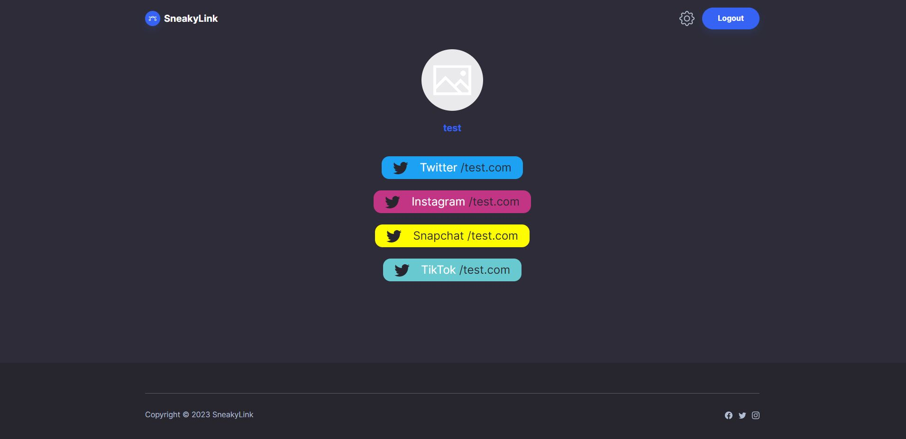

# SneakyLink
Collect all of your important links on one page under one SneakyLink, and share it in your social media bios, your website, or wherever you want to people to connect with you!
  

  
## Challenge Description | User Story
### **AS a User**  
AS A user wanting to share my social media platforms and general interests with others,
I WANT to be able to collect all of my links on one easy to share page,
SO THAT others can easily have access to my content.

### **Acceptance Criteria**

GIVEN an application which achieves the user story above:  
WHEN I visit SneakyLink for the first time,  
THEN I am prompted to create an account.  
WHEN I have created my account,  
THEN I can login and begin to add links to my socials on my page.  
WHEN I have entered my usernames for the available social media platforms,  
THEN this information is saved to my account. 
WHEN I visit my profile page,  
THEN my social media accounts appear on the page as clickable links.  
WHEN a user clicks a link,  
THEN my social media page is opened and they can follow, like, or simply view my content.  
 
  
## SneakyLink ScreenShot
;

### **Areas For Future Development**

- Add the ability to upload profile pictures, and customize the background of the profile page.

- Add a section for a short bio to be displayed on the user profile page.

- Implement a more secure system for sharing the profile pages via one link.

- Allow for the user to add custom links to their page (for example a website).

- (LONG TERM): Expand upon the concept to allow the user to create curated pages of links. For example, a user could create a page of links specifically to recipes, outfits, or blogs. The user profile page would now display links to their curated pages of links, in addition any simple links (to social media or websites) that they would like to display on their main profile page.